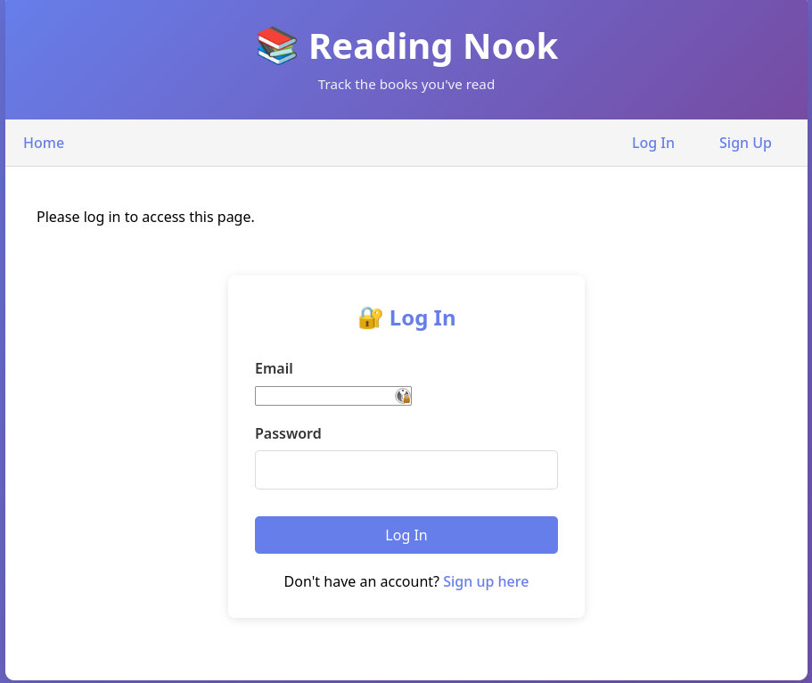
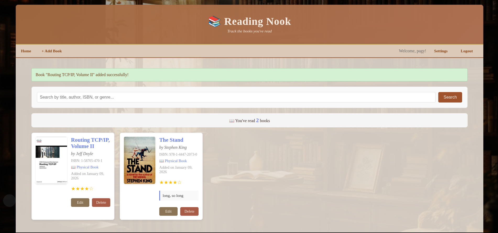

[](https://github.com/pagyP/readingnook/actions/workflows/python-app.yml)

[](https://github.com/pagyP/readingnook/actions/workflows/bandit.yml)

[](https://github.com/pagyP/readingnook/actions/workflows/docker-build-push.yml)

[](https://github.com/pagyP/readingnook/actions/workflows/github-code-scanning/codeql)


# Reading Nook 📚

A simple Flask web application to track and record the books you've read.

## Features

- ✅ Add books you've read with title, author, and date
- 🔍 **Auto-lookup book info from ISBN** - Automatically fetch title, author, and genre using Open Library API
- ⭐ Rate books on a 1-5 star scale
- 📝 Add personal notes and thoughts about each book
- ✏️ Edit book entries
- 🗑️ Delete books from your collection
- 📊 View all your books in a beautiful grid layout
- 🔐 **Password-less account recovery** - Recover accounts using recovery codes (no email required)
- ⚙️ **Account settings** - Change email address with password verification
- 🎨 **Warm library aesthetic** - Cosy, literary-inspired design with warm browns and serif typography
- ♿ **Accessible design** - WCAG AA/AAA compliant color contrast and responsive layouts

## Installation

This application **requires Docker and Docker Compose**. All other setup is handled automatically by the container.
### Development (Contributors)

1. **Clone the project:**
   ```bash
   git clone https://github.com/pagyP/readingnook.git
   cd readingnook
   ```

2. **Set environment variables:**
   ```bash
   cp .env.example .env
   # Edit .env and set SQLALCHEMY_DATABASE_URI and SECRET_KEY
   ```

3. **Start the application (builds from local Dockerfile):**
   ```bash
   docker compose up -d
   ```

4. **Open your browser** and navigate to `http://localhost:8000`

### Production (Users)

For users who want to run the pre-built image from GitHub Container Registry:

1. **Create environment file:**
   ```bash
   # Create .env with your database configuration
   DB_USER=readingnook
   DB_PASSWORD=<change-to-secure-password>
   DB_NAME=readingnook
   SECRET_KEY=<generate-with-python>
   FLASK_ENV=production
   SESSION_COOKIE_SECURE=True
   ```

2. **Create docker-compose file:**
   ```bash
   # Copy the production compose file
   cp docker-compose.prod.yml docker-compose.yml
   ```

3. **Start the application (uses pre-built image):**
   ```bash
   docker compose up -d
   ```

4. **Open your browser** and navigate to `http://localhost:8000`

**Note:** Database schema is created automatically on startup via `init_db.py`. If you're upgrading from a version created before the MFA feature, see [DOCKER_DEPLOYMENT.md](DOCKER_DEPLOYMENT.md) for schema migration instructions.

For detailed Docker and production deployment instructions, see [DOCKER_DEPLOYMENT.md](DOCKER_DEPLOYMENT.md).

## Security Features

✅ **User Authentication** - Create accounts with secure password hashing  
✅ **Password Hashing** - Passwords hashed using Argon2 (memory-hard, GPU-resistant)  
✅ **Account Recovery** - Recover lost passwords using single-use recovery codes (no email required)  
✅ **Session Management** - Secure session handling with Flask-Login and 24-hour persistent timeout  
✅ **CSRF Protection** - All forms protected with CSRF tokens via Flask-WTF  
✅ **Data Isolation** - Users can only see and edit their own books  
✅ **Environment Variables** - Secret key stored in .env (not committed to git)  
✅ **Form Validation** - Email format and password confirmation validation  
✅ **Rate Limiting** - Login attempts limited to 5 per minute to prevent brute force; email changes limited to 10 per hour  
✅ **Security Logging** - All authentication events logged for audit trail  
✅ **Email Security** - Email display on signup prevents user lockout from typos; settings page allows secure email changes with password verification  
✅ **Accessibility** - WCAG AA/AAA color contrast standards for inclusive design (7:1+ contrast ratios)

## Project Structure

```
readingnook/
├── app.py                    # Main Flask application and routes
├── requirements.txt          # Python dependencies
├── README.md                 # This file
├── .gitignore                # Git ignore rules
├── LICENSE                   # MIT License
├── Dockerfile                # Docker container definition
├── docker-compose.yml        # Docker Compose for development
├── docker-compose.prod.yml   # Docker Compose for production
├── nginx.conf                # Nginx configuration for production
├── DOCKER_DEPLOYMENT.md      # Docker and deployment guide
├── RECOVERY_CODES.md         # Password recovery documentation
├── RECOVERY_CODE_SECURITY.md # Recovery code security details
├── SECURITY_HARDENING.md     # Security best practices
├── OPEN_LIBRARY_INTEGRATION.md # ISBN lookup feature guide
├── static/
│   └── images/
│       └── cosy-library.jpg   # Background image
├── templates/
│   ├── base.html             # Base template with styling
│   ├── index.html            # Home page (book list)
│   ├── login.html            # Login page
│   ├── register.html         # Registration page
│   ├── add_book.html         # Form to add a new book
│   ├── edit_book.html        # Form to edit a book
│   ├── settings.html         # Account settings (email change)
│   ├── recovery_codes.html   # Display recovery codes
│   ├── forgot_password.html  # Password recovery entry point
│   ├── reset_password.html   # Password reset form
│   └── isbn_lookup_script.html # ISBN lookup helper
└── tests/
    ├── conftest.py           # Pytest configuration
    ├── test_app.py           # Comprehensive test suite
    └── __init__.py
```

## Usage

### Creating an Account
1. Click "Sign Up" in the top navigation
2. Enter a username, email, and password
3. Confirm your password and submit
4. You'll be redirected to log in with your new account

### Logging In
1. Click "Log In" on the home page
2. Enter your email and password
3. You'll be logged in and can start adding books
4. Your session will persist for 24 hours even if you close your browser

### Account Settings
1. Click "Settings" in the top navigation (when logged in)
2. View your registered email address
3. To change your email: Enter your new email and confirm your password
4. Email changes are rate-limited to 10 per hour for security
5. Your new email will be used for future logins

### Logging Out
1. Click "Logout" in the top right navigation
1. On the login page, click "Recover your account"
2. Enter your email address and one of your recovery codes (saved during account creation)
3. Set a new password
4. Log in with your new password

**⚠️ Important:** Recovery codes are shown once after account creation. Save them in a secure location (password manager, encrypted note, etc.). See [RECOVERY_CODES.md](RECOVERY_CODES.md) for detailed information.

### Adding a Book
1. Click "+ Add Book" in the navigation
2. Fill in the book details (title and author are required)
3. Select the date you finished reading
4. Optionally add a rating and notes
5. Click "Save Book"

### Editing a Book
1. On the home page, click "Edit" on any book card
2. Modify the details as needed
3. Click "Update Book"

### Deleting a Book
1. On the home page, click "Delete" on any book card
2. Confirm the deletion

## Design & Accessibility

**Warm Library Aesthetic** - The application features a cosy, literary-inspired design with:
- Warm color palette (cream, brown, gold) evoking a personal library
- Georgia serif typography for a literary feel
- Responsive grid layout for books
- Bookshelf background with adjustable opacity

**Accessibility Standards** - Meets WCAG AA/AAA compliance:
- 7:1+ color contrast ratios for text readability
- Responsive design that works on all device sizes
- Semantic HTML structure
- Form validation with clear error messages
- Rate limiting to prevent user frustration from failed attempts

- **[RECOVERY_CODES.md](RECOVERY_CODES.md)** - Complete guide to password recovery using recovery codes
- **[OPEN_LIBRARY_INTEGRATION.md](OPEN_LIBRARY_INTEGRATION.md)** - ISBN lookup and auto-fill feature guide
- **[DOCKER_DEPLOYMENT.md](DOCKER_DEPLOYMENT.md)** - Docker and production deployment guide

## Future Enhancements

Consider adding:
- Book covers/images  
- Genre/categories (enhanced categorization)
- Reading progress tracking
- Statistics and reading goals
- Email notifications for security events
- Book recommendations based on reading history
- Export reading history (CSV, PDF)
- Social features (share lists, follow other readers)
- Book club features

## Technologies Used

- **Backend:** Flask 3.1.2 (Python web framework)
- **Database:** PostgreSQL 18.1 (required)
- **ORM:** SQLAlchemy 3.0.5
- **Authentication:** Flask-Login 0.6.3, Flask-WTF 1.2.1
- **Password Hashing:** Argon2-cffi 25.1.0 (memory-hard hashing)
- **Rate Limiting:** Flask-Limiter 4.1.1
- **Frontend:** HTML5, CSS3 (responsive design)
- **Testing:** Pytest 7.4.4 (82 comprehensive tests covering authentication, MFA, books, and recovery)
- **Containerization:** Docker & Docker Compose (required)
- **Deployment:** Gunicorn 22.0.0, Nginx

## License

Feel free to use and modify this project!

## Screenhots

